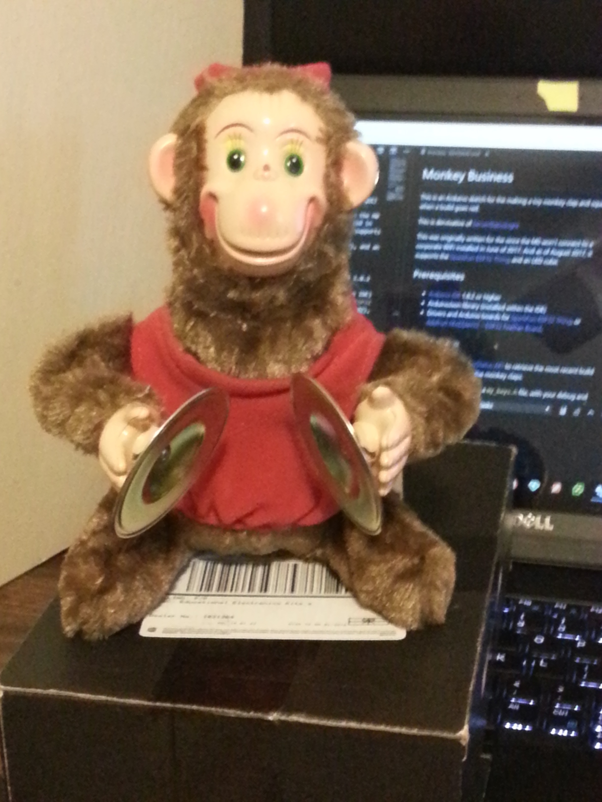
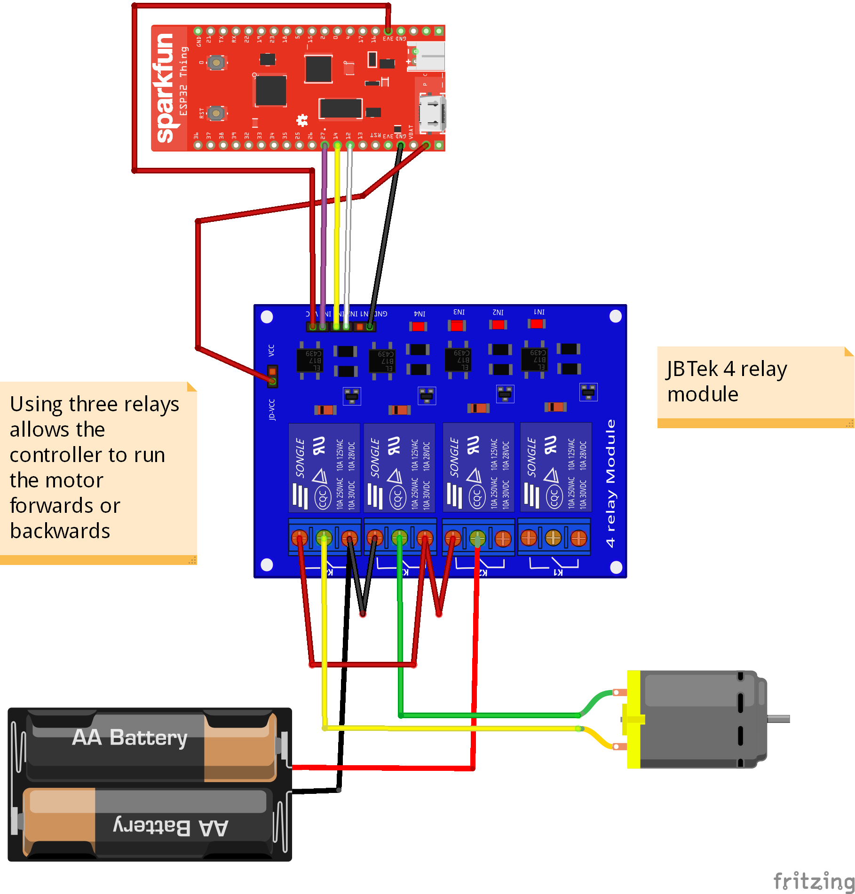

# Monkey Business
This is an Arduino sketch for the making a toy monkey clap and squeak when a build goes red.

<br/>

This is dervivative of [ServerStatusLight](https://github.com/Seekatar/ServerStatusLight)

This was originally written for the since the M0 won't connect to a corporate WiFi installed in June of 2017.  And as of August 2017, it supports the [SparkFun ESP32 Thing](https://www.sparkfun.com/products/13907), and an LED cube.
## Prerequisites
* [Arduino IDE](https://www.arduino.cc/en/Main/Software) 1.8.2 or higher
* ArduinoJson library (installed within the IDE)
* Drivers and Arduino boards for [SparkFun ESP32 Thing](https://www.sparkfun.com/products/13907), or [Adafruit HUZZAH32 – ESP32 Feather Board](https://www.adafruit.com/product/3405).

## The Program
The sketch polls the [ServerStatus API](https://github.com/seekatar/ServerStatus) to retrieve the most recent build status.  If a build goes red, the monkey claps.

Since the monkey squeaks, then claps, I tried to get it to do either one by running the motor forwards and backwards, but since it's just a DC motor, it would get out of sync quickly.

To compile the sketch, create a `my_keys.h` file, with your debug and production WiFi setup.  This is in the .gitignore to avoid committing passkeys.  The code will try to connect to prod first, then debug.  Here's an example:

```c
#include "Location.h"

#define SERVER_STATUS_PATH "/api/status/statusOnly?count=12"

// IP Addresses are server IPs
Location Locations[2] = {Location("DebugSSID","myWPA2secrect",
                        IPAddress(192,168,1,103),SERVER_STATUS_PATH,5000),
                        Location("ProdSSID","myWPA2secrect",
                        IPAddress(172,16,32,186),SERVER_STATUS_PATH,5000)};
```
## Hardware
* [Adafruit HUZZAH32 – ESP32 Feather Board](https://www.adafruit.com/product/3405), or [SparkFun ESP32 Thing](https://www.sparkfun.com/products/13907)
* [JBTek 4 Relay board](https://www.amazon.com/JBtek-Channel-Module-Arduino-Raspberry/dp/B00KTEN3TM/ref=sr_1_3?ie=UTF8&qid=1503920005&sr=8-3&keywords=4+relay+board) or something comparable to try to make it go forward and backwards.  Otherwise only a single relay is needed.
* Small Breadboard

<a href="./Doc/Monkey.fzz"></a><br/>